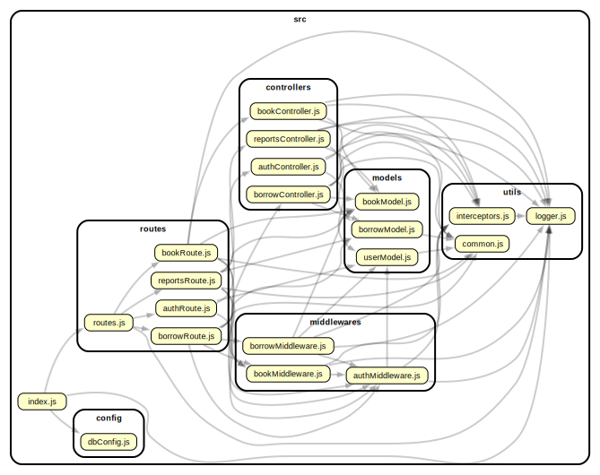

# Nalanda Library Management System

[API Documentation](https://documenter.getpostman.com/view/18702151/2sBXVfkXDo).

A comprehensive backend server for a library management application with RESTful APIs built with Node.js, Express, and MongoDB etc.

## Features

**User Management**

- User Registration : using {name, email, password}
- User Login: using {email, password}
- admin has all accesses, while member has restricted accesses

  **Book Management**

- Add Book: Only admin can add new book
- Update Book: Only admin can update book details
- Delete Book: Only admin can delete book from the library.
- view/List Books: All users can view list of books + optional pagination + optional filtering(by title, author, genre) + optional limitation (default 50, if not given)

  **Borrowing System**

- Borrow Book: Members can borrow a book. Ensure the book is available (copies > 0)
- Return Book: Members can return a borrowed book.
- Borrow History: Members can view their borrowing history

  **Reports & Analytics**

- Most Borrowed Books: Report of the most borrowed books.
- Active Members: Report of the most active members based on borrowing history.
- Book Availability: Summary report of total books availability in counts (total books, borrowed books, available books).

  **Security**

- Encrypted JWT tokens, with expiry duration 1 day
- Password hashing with bcrypt
- Role-based authorization for members and admins
- Input validation on all endpoints
- Compound indexes at required fields
- Secured/Hidden credentials using .env

## 📊 Project Structure



## Installation & Setup

### Prerequisites

- Node.js (v22.20.0)
- npm or yarn

### Steps

1. **Clone repository**

```bash
git clone <https://github.com/hemanth5544/nalanda.git>

```

2. **Install dependencies**

```bash
npm install
```

3. **Configure environment variables**
   Create `.env` file:

```
DB_URL=mongodb://localhost:27017/library_db
PORT=3000
JWT_PRIVATE_KEY=''
```

4. **Run development server**

```bash
npm run dev
```

5. **Run server with build**

```bash
npm start
```

Server runs on `http://localhost:3000`

## API Endpoints

### Authentication

| Method | Endpoint           | Description       |
| ------ | ------------------ | ----------------- |
| POST   | `/api/auth/signup` | Register new user |
| POST   | `/api/auth/login`  | User login        |

### Books

| Method | Endpoint               | Description    | Role         |
| ------ | ---------------------- | -------------- | ------------ |
| GET    | `/api/book/view`       | List all books | Member/Admin |
| POST   | `/api/book/add`        | Add new book   | Admin        |
| PATCH  | `/api/book/update/:id` | Update book    | Admin        |
| DELETE | `/api/book/delete/:id` | Delete book    | Admin        |

### Borrowing

| Method | Endpoint                           | Description        | Role         |
| ------ | ---------------------------------- | ------------------ | ------------ |
| POST   | `/api/borrow/create`               | Borrow book        | Member/Admin |
| POST   | `/api/borrow/return`               | Return book        | Member/Admin |
| GET    | `/api/borrow/view/history/:userId` | Get borrow history | Member/Admin |

### Reports

| Method | Endpoint                                 | Description              | Role  |
| ------ | ---------------------------------------- | ------------------------ | ----- |
| GET    | `/api/reports/books/mostBorrowed`        | Most borrowed books      | Admin |
| GET    | `/api/reports/members/mostActive`        | Active members list      | Admin |
| GET    | `/api/reports/books/availabilitySummary` | Book availability report | Admin |

## Role-Based Access Control

**Member Role:**

- View all books
- Search & filter books
- Borrow and return books
- View his borrowing history

**Admin Role:**

- All member permissions
- Add, update, delete books
- View borrowing records of his or any authorized user
- Access all reports & analytics

## Error Handling

All endpoints return consistent error responses:

```json
{
  "error": true,
  "message": "Error description",
  "data": {}
}
```

Status codes:

- `200`: Successful response
- `400`: Validation error
- `401`: Auth denied
- `403`: Permission denied
- `409`: Resource not found / Duplicate Records
- `500`: Internal server error
